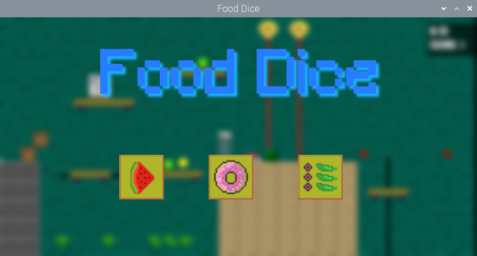
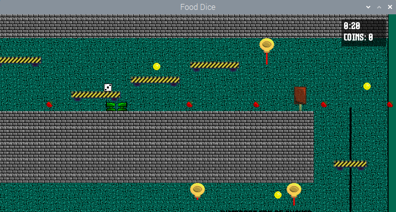
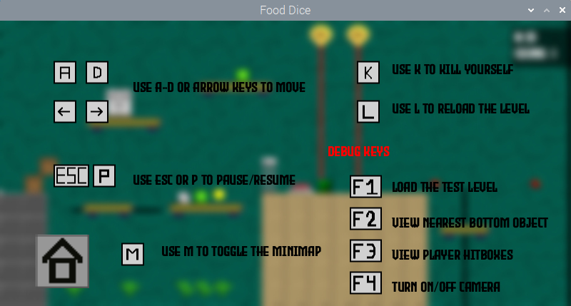
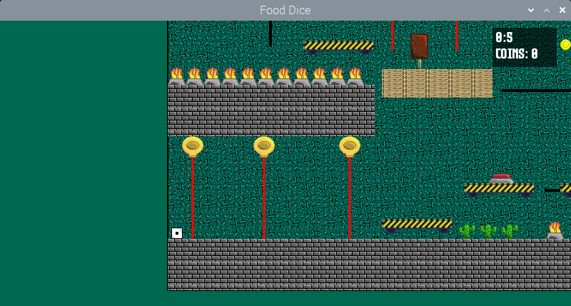

# FoodDice
Game made for the GMTK Game jam 2022. Food Dice is a food platformer where you are a dice and every 15 seconds, based on which face you land on, you get special effects. You have to reach the end without getting into lasers or shooters.

# Keys to use
* A-D / Arrows to move
* Space to jump
* M to toggle minimap
* K to kill yourself
* P to pause/resume
* L to reload the level
   
Try to beat your highscore time and get all the coins!

Made in 48h with java without a game engine for the GMTK Game jam 2022.

# Install instuctions
Please visit https://github.com/OrangoMango/FoodDice/releases/latest

# Screenshots

