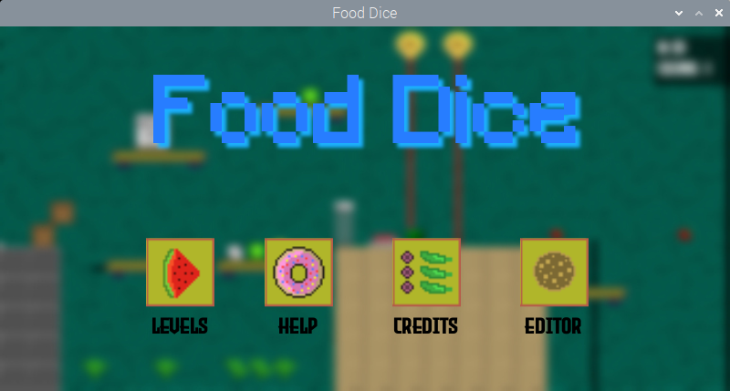

# FoodDice
Game made for the GMTK Game jam 2022. Food Dice is a food platformer where you are a dice and every 15 seconds, based on which face you land on, you get special effects. You have to reach the end without getting into lasers or shooters.

<a href="https://orangomango.itch.io/food-dice" /></a>

Youtube: https://youtu.be/NKm-SZMfd1k

# Keys to use
* A-D / Arrows to move
* Space to jump
* M to toggle minimap
* K to kill yourself
* P to pause/resume
* L to reload the level
   
Try to beat your highscore time and get all the coins!

Made in 48h with java without a game engine for the GMTK Game jam 2022. (v1.0)

# Install instuctions
Please visit https://github.com/OrangoMango/FoodDice/releases/latest

# Compile it yourself
* Be sure to have JDK 17+
* Compile and run the entire game with the command:
```
./gradlew run
```

# Screenshots



